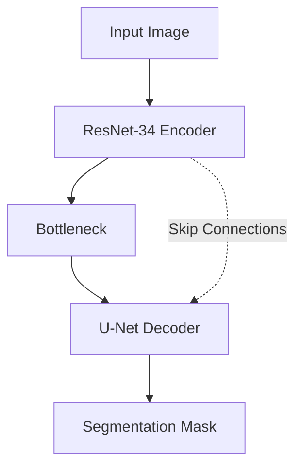

# Shot Peening Surface Deformation Detection AI

## Description
This project implements a deep learning system for detecting surface deformations caused by shot peening processes using semantic segmentation. The system leverages state-of-the-art Convolutional Neural Networks (CNN) to automatically and accurately segment areas of deformation on material surfaces.

## Architecture Diagram


## Installation

1. Clone the repository:
   ```bash
   git clone <repository_url>
   cd shot-peening-ai
   ```

2. Create a virtual environment:
   ```bash
   python -m venv venv
   source venv/bin/activate  # On Windows use `venv\Scripts\activate`
   ```

3. Install the required dependencies:
   ```bash
   pip install -r requirements.txt
   ```

## Data Preparation

### Directory Structure
```
data/
├── raw/            # Original images and annotations
├── images/         # Processed input images
└── masks/          # Processed segmentation masks
```

### Annotating with LabelMe
1. Install LabelMe: `pip install labelme`
2. Run LabelMe: `labelme`
3. Open the directory containing your raw images.
4. Use the polygon or paint tool to trace the boundaries of surface deformations.
5. Save the annotations. LabelMe will generate JSON files corresponding to each image.

### Processing Data
Run the data preparation script to convert LabelMe JSON annotations into binary mask images and organize the dataset:
```bash
python src/prepare_data.py --input_dir data/raw --output_dir data/
```

## Training

### Basic Command
```bash
python src/train.py --data_dir data/
```

### CLI Arguments
- `--data_dir`: Path to the dataset directory containing `images/` and `masks/` (default: `data/`).
- `--batch_size`: Batch size for training (default: 8).
- `--epochs`: Number of training epochs (default: 100).
- `--lr`: Learning rate (default: 1e-4).
- `--img_size`: Input image resolution (default: 512).

### Expected Output and Metrics
The script will output training and validation loss, Dice score, and IoU (Intersection over Union) after each epoch. The best model checkpoints will be saved in `outputs/models/`.

## Inference

### Single Image Inference
```bash
python src/predict.py --model_path outputs/models/best_model.pth --input path/to/image.tif
```

### Batch Inference
```bash
python src/predict.py --model_path outputs/models/best_model.pth --input path/to/image_dir/ --output_dir results/
```

### Output Files
The script will generate image files with the predicted segmentation masks overlaid on the original images, saved in the specified output directory.

## Google Colab Setup
To run this project on Google Colab, use the following commands in the first cell:
```python
!git clone <repository_url>
%cd shot-peening-ai
!pip install -r requirements.txt
```

## Project Structure
```
shot-peening-ai/
├── data/
├── outputs/
│   ├── logs/
│   └── models/
├── src/
│   ├── config.py
│   ├── prepare_data.py
│   ├── train.py
│   ├── predict.py
│   └── ...
├── requirements.txt
└── README.md
```

## Performance Expectations
With sufficient high-quality annotated data, the model is expected to achieve a Dice score of over 0.85 on the validation set, providing reliable automated defect detection.

## Troubleshooting
- **CUDA out of memory**: Reduce the `--batch_size` or `--img_size` during training.
- **Missing dependencies**: Ensure you have activated your virtual environment and run `pip install -r requirements.txt`.
- **Poor predictions**: Verify that the annotation quality is high and that the model has been trained for a sufficient number of epochs.
